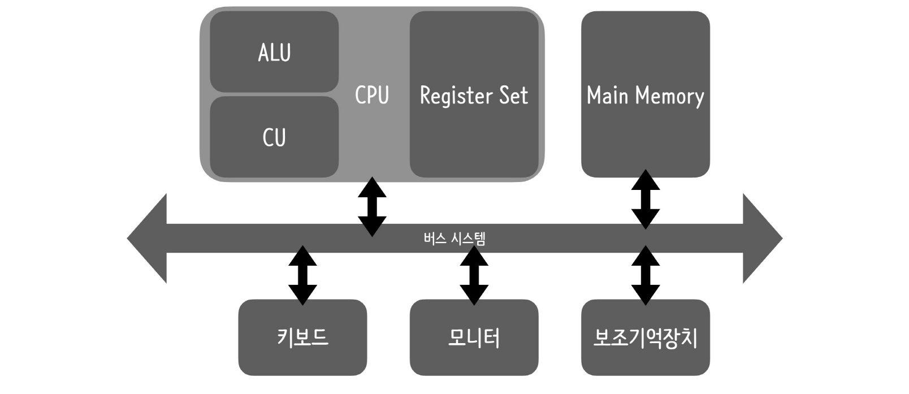
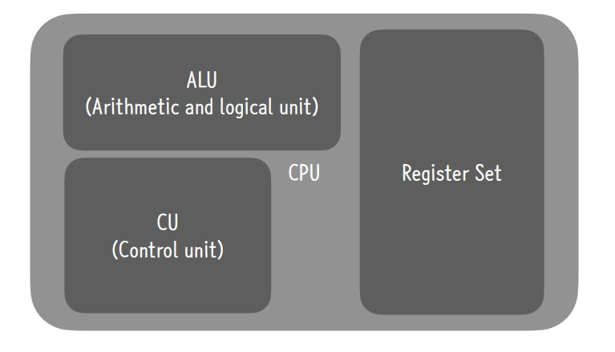

# 컴퓨터 하드웨어 구조

```
## 1. CPU의 구성요소인 ALU, CU, 그리고 레지스터 각각의 역할

```
### 1. ALU (Arithmetic and Logical Unit - 산술 논리 장치)
```
- 산술 및 논리 연산을 수행하는 파트.
- 덧셈, 뺄셈, 곱셈, 나눗셈 등의 산술연산과 AND, OR, NOT 등의 논리연산을 담당한다.
- 이과적인 부분만 담당하고 문과적인건 아닌 그런 느낌..?
```