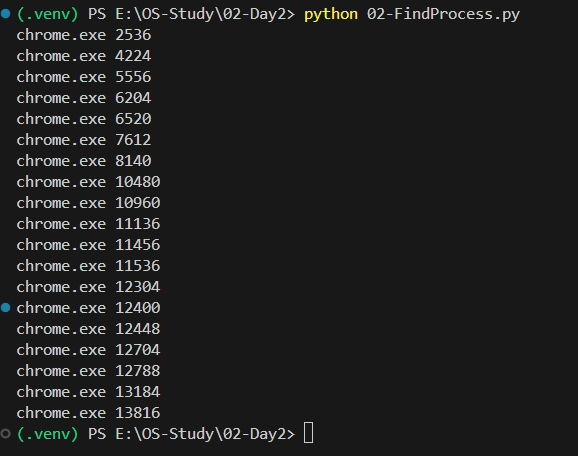
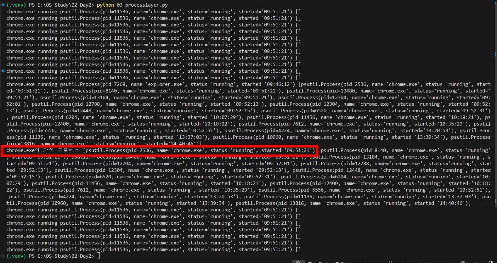

# 컴퓨터 하드웨어 구조


## 1. CPU의 구성요소인 ALU, CU, 그리고 레지스터 각각의 역할


### 1. ALU (Arithmetic and Logical Unit - 산술 논리 장치)
```
- 산술 및 논리 연산을 수행하는 파트.
- 덧셈, 뺄셈, 곱셈, 나눗셈 등의 산술연산과 AND, OR, NOT 등의 논리연산을 담당한다.
- 이과적인 부분만 담당하고 문과적인건 아닌 그런 느낌..?
```
### 2. CU (Control Unit - 제어장치)
```
- 명령어를 해석하고 실행하는 역할
- CPU의 동작을 제어하며, 명령어를 해독하여 각 구성요소에 적절한 제어신호를 발생시킨다.
- 메모리에서 명령어를 읽어와 해석하고, 실행 순서를 조절한다.
- 입력장치(키보드, 마우스 등),  출력 장치(모니터, 스피커, 프린터 등)와의 상호작용을 조정한다.
```
### 3. Register (레지스터)
```
- CPU 내부에 위치한 고속 데이터 저장소
- CPU가 데이터를 임시로 보관하고 처리하는데 사용된다
- CPU가 연산을 수행하거나 데이터를 임시로 저장할 때 사용된다
- 연산에 필요한 데이터나 주소 등을 보관하고, ALU나 CU가 필요할 때 데이터를 직접 가져다 사용한다
```

## 2. 메인메모리와 보조기억장치의 차이
### 1. 접근 속도
```
- 메인메모리는 RAM(Random Access Memory)로 구성되어 있는데, CPU와 직접적으로 연결되어 있어 매우 빠른 접근 속도를 제공한다. 그렇기에 CPU가 데이터를 빠르게 읽고 쓸 수 있다.
- 그러나 보조기억장치(FDD, HDD, SSD, ODD, USB 플래시 드라이브 등)는 메인메모리보다 느리다.
```
### 2. 저장용량과 가격
```
- 메인메모리는 보조기억장치에 비해 용량이 작다.
- 또한 메인메모리는 보조기억장치에 비해 가격당 용량도 작다.
```
### 3. 휘발성이냐 비휘발성이냐의 차이
```
- 메인메모리는 휘발성이라 전원이 꺼지면 저장된 데이터가 사라진다.
- 그러나 보조기억장치는 데이터를 영구적으로 저장하고 보관하기 위해 사용되는 장치이기에 전원이 꺼져도 데이터가 보존되는 비휘발성을 갖고 있다.
```

## 3. 버스시스템
### 1. 주소버스 (Address Bus)
```
- CPU가 메모리나 입출력장치와 통신할 때 사용되는 버스
- CPU가 메모리나 입출력 장치에 접근할 때 해당 장치의 주소를 전달하기 위해 사용된다
- 주소 버스의 폭은 메모리 주소 공간의 크기를 결정한다. 이는 CPU가 직접 접근할 수 있는 메모리의 양을 결정한다.
```
### 2. 데이터 버스 (Data Bus)
```
- CPU와 메모리, 그리고 CPU와 입출력장치 간에 데이터를 전송하는데 사용된다.
- CPU가 메모리에서 데이터를 읽기/쓰기할 때 사용된다
- 데이터 버스의 폭은 한번에 전송할 수 있는 데이터의 비트 수를 결정하는데, 이는 시스템의 데이터 전송속도를 의미한다.
```
### 3. 제어 버스 (Control Bus)
```
- CPU와 다른 하드웨어 간의 제어신호를 전달하는데 사용된다.
- 여러가지 신호가 포함될 수 있다. (ex: 읽기/쓰기 동작을 나타내는 신호, 클릭 신호)
- CPU와 다른 장치 간의 상호작용을 조정하고, 동기화하는데 사용된다.
```

# 인터럽트 테스트
```
- 강의 영상을 보며 인터럽트 테스트를 실행하는 코드를 만들고 진행해보았다
```
