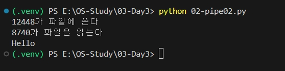
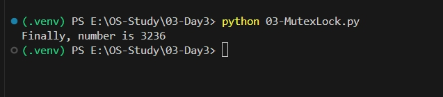
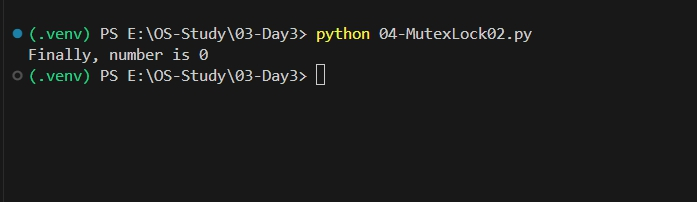

## 3일차 과제 (식사하는 철학자)
[식사하는철학자](식사하는철학자.md)

### 1. 프로세스간 통신 테스트 (01-pipe.py)


### 2. 프로세스간 통신 추가 테스트 (02-pipe02.py)


### 3. 동기화 실습(프로세스간 동기화) - Mutex Lock 미적용으로 생기는 문제 테스트 (03-MutexLock.py)

```
- 결과값이 0이 나와야되는데 안되었다.
- 동기화 문제가 발생을 했기 떄문이다.
- p1과 p2가 동시다발적으로 접근을 하여 값이 꼬였기 때문이다.
```

### 4. 동기화 실습(프로세스간 동기화) - Mutex Lock 적용함으로 해결 테스트 (04-MutexLock02.py)

```
- multiprocessing 중에 Lock이라는 모듈을 이용한다.
- Mutex Lock은 다른 프로세스로부터 임계구역을 보호하고 경쟁상태(race condition)을 예방한다.
- Mutex Lock을 이용하는 프로세스들은 임계구역 입장 전 Lock을 얻어야 하고, 나갈때는 Lock을 해제해야 한다.
- 그리하여 최종적으로는 p1이 먼저 실행되어 5000번 증가시킨 다음 Lock 해제하고 나간 것이고,
- 뒤에 들어온 p2는 5000번 감소시킨 뒤 Lock을 해제하고 나갔기에 결과값으로 0이 표출된 것이다.
- 이 부분은 Thread에서도 동일하게 적용된다.
```