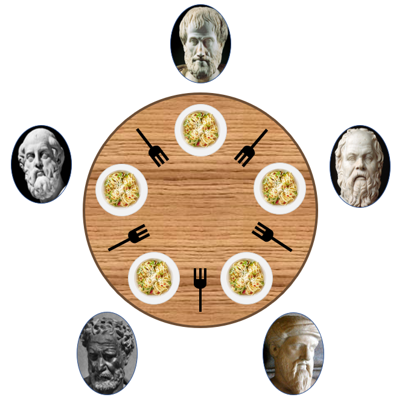

# 식사하는 철학자 (Dining Philosophers Problem)


## 1. 개요
### 운영체제의 교착(데드락) 상태를 설명하기 위한 문제로, 1965년 에츠허르 다익스트라가 만든 문제이다.
### 컴퓨터과학에서 동시성과 교착 상태를 설명하는 예시로, 여러 프로세스(또는 스레드)가 동시에 돌아갈 때 교착 상태가 나타나는 원인을 직관적으로 알 수 있다.

## 2. 상세
```
다섯 명의 철학자가 하나의 원탁에 앉아 식사를 한다. 각각의 철학자들 사이에는 포크가 하나씩 있고, 앞에는 접시가 있다.
접시 안에 든 요리는 포크를 두개 사용하여 먹어야만 하는 스파게티 이다.
그리고 각각의 철학자는 다른 철학자에게 말을 할 수 없으며, 번갈아가며 각자 식사하거나 생각하는 것만 가능하다.
따라서 식사를 하기 위해서는 왼쪽과 오른쪽의 인접한 철학자가 모두 식사를 하지 않고 생각하고 있어야만 한다.
또한 식사를 마치고 나면, 왼손과 오른손에 든 포크를 다른 철학자가 쓸 수 있도록 내려놓아야 한다.
이 때, 어떤 철학자도 굶지 않고 식사할 수 있도록 하는 방법은 무엇인가?
```
### 이 이외의 상세 부분 등은 나무위키를 참조하자.

## 3. 해결방법 (GPT 활용)
### 1. 포크 번갈아 가짐 (Alternate Fork Ownership)
```
- 각 철학자는 왼쪽과 오른쪽에 하나의 포크를 가지도록 한다.
- 식사를 하려는 철학자는 먼저 왼쪽 포크를 쥔다.
- 그 다음 오른쪽 포크를 집어 식사를 시작한다
- 젓가락을 놓을 때는 반대 순서로 놓는다.
```
### 2. 음식(자원)에 대한 중재자 (Resource Allocator)
```
- 한 번에 한명의 철학자만이 식사하도록 중재자를 도입한다.
- 각 철학자는 중재자에게 포크를 사용할 수 있는지 묻는다.
- 중재자는 포크의 사용여부를 결정하고, 사용이 가능하도록 허용한다.
- 식사가 끝나면 포크를 반환한다.
```
### 3. 시간 제한 (Time Limit)
```
- 각 철학자는 일정 시간 내에 식사를 마쳐야 한다.
- 일정 시간 동안 식사를 못마친 철학자는 포크를 내려놓고 다른 철학자에게 양보한다.
- 이 방법은 교착 상태를 방지하고 무한 대기를 막을 수 있다.
```
### 4. 음식(자원) 요청 순서 (Resource Request Ordering)
```
- 모든 철학자가 포크를 집는 순서를 정하고, 포크를 집는 순서를 따른다.
- 이로써 일부 철학자가 음식을 기다리는 상황이 발생하지 않도록 한다.
```
### 그 외 구글링을 통해 블로그 게시글 등을 여러 개를 보았지만 대부분 비슷했다.
### 또한, 혼자 스스로 생각했을 때와 구글링과 GPT를 활용했는데도 결론은 같았다.

## 4. 결론
### 어떠한 방법으로 머리를 굴리고 제어를 해도 굶는 놈은 생긴다. 이유는 포크를 두개를 사용해야만 하기 때문.
