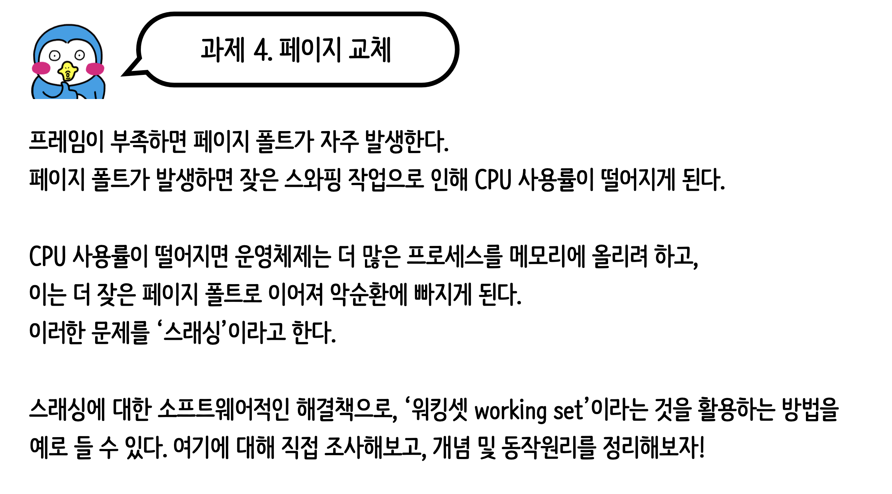

# 4일차 과제


## 스레싱이란?
```
- 페이지 폴트가 지나치게 빈번하게 발생하여 시스템의 성능이 급격이 저하되는 현상
```

## 그렇다면 페이지 폴트는 무엇인가?
```
- 프로세스가 필요로 하는 데이터나 코드가 메모리에 없어 디스크(보조기억장치)에서
- 해당페이지를 가져와야 할 때 발생한다.
```

## 워킹셋 (Working Set)
```
- 운영체제에서 메모리 관리에 사용되는 개념
- 주로 가상메모리 시스템에서 활용된다
- 프로세스가 실행될 때 해당 프로세스가 실제로 필요로 하는 메모리의 집합을 의미한다.
```
### 워킹셋을 유지하기 위해 OS는 프로세스의 메모리 액세스 패턴을 지속적으로 모니터링한다.
### 이를 통해 프로세스가 실제로 필요로 하는 메모리 공간을 추적, 이를 기반으로 페이지 교체 등의 메모리 관리작업을 수행한다.

## 워킹셋의 장단점
### 장점
```
- 워킹셋을 사용하여 프로세스가 실제로 필요호로 하는 메모리 공간만 메모리에 유지함으로 메모리의 낭비를 최소화 한다. (메모리 효율성)
- 페이지 폴트를 최소화하고 스레싱을 방지하여 시스템의 성능을 향상시킨다. (성능향상)
```
### 단점
```
- 워킹셋을 유지하기 위해 OS는 메모리 사용 패턴을 지속적으로 추적해야만 하고, 이 과정은 오버헤드를 초래할 수 있다
- 정확한 크기 결정에 어려움이 있다. 너무 작게 설정하면 페이지 폴트가 빈번하게 발생할 수 있고, 너무 크게 설정하면 메모리의 낭비가 발생하기 때문
```
