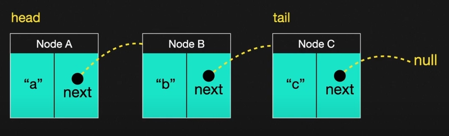
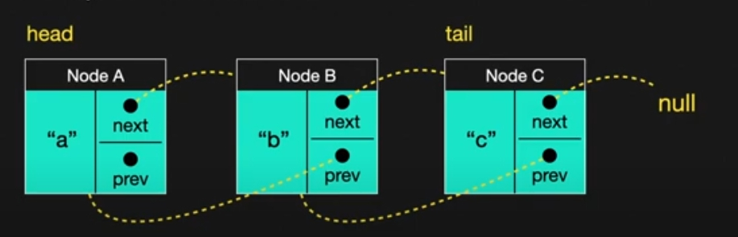
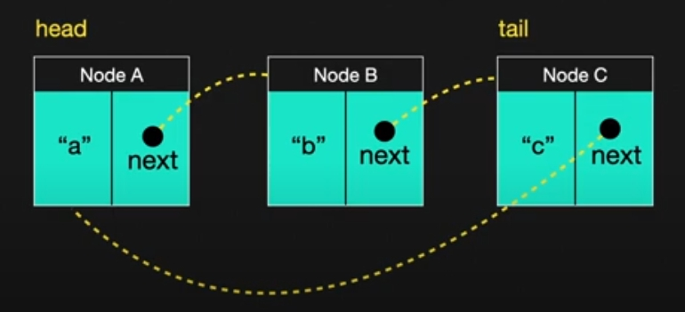
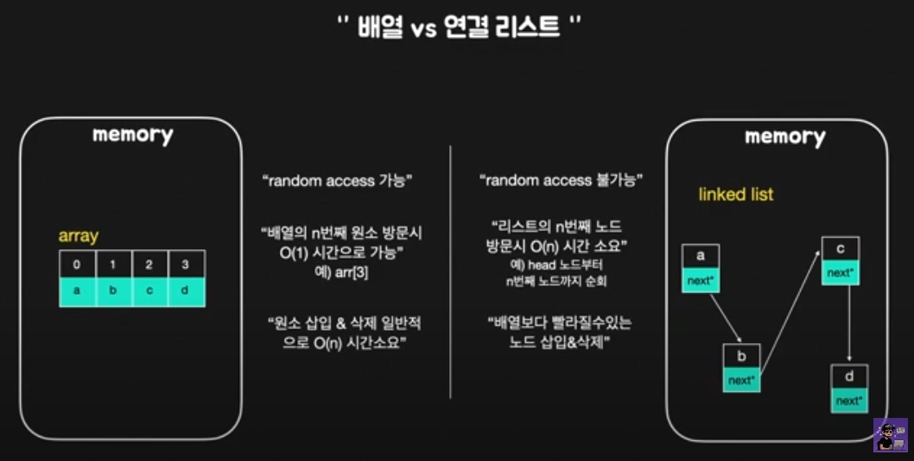

# Linked List (연결리스트)

## 1. Linked List란?
### 연속된 노드(Node)의 연결체
```
- 추상적 자료형인 리스트를 구현한 자료구조
- Linked List라는 말 그대로 어떤 데이터 덩어리 (이하 Node)를 저장할 때 그 다음 순서의 자료가 있는 위치를 데이터에 포함시키는 방식으로 자료를 저장한다.
- 자료를 비엔나 소시지마냥 줄줄이 엮어놓은 것으로 생각하면 된다.
```
### 그럼 Node란 무엇인가?
```
- 연결리스트에서 사용되는 하나의 데이터 덩어리와 링크. 이 두 가지의 필드를 담고 있는 구조
```


## 2. 연결리스트의 종류
### 1. 단일 연결 리스트 (Singliy Linked List)

```
- 큐(Queue)를 구현할 때 사용하는 방법
- 다음 노드에 대한 참조만을 가진 가장 단순한 형태의 연결리스트
- 가장 마지막 원소를 찾으려면 얄짤없이 리스트 끝까지 찾아가야 하기에, 마지막 원소를 가리키는 참조를 따로 가지는 형태의 변형도 있다.
- Head Node (첫번째 데이터 노드)를 참조하는 주소를 잃어버릴 경우 데이터 전체를 못쓰게 되는 단점이 있다.
- FAT 파일 시스템이 이 연결 리스트로 파일청크를 연결하다보니 파일 내용 일부가 손상될 경우 상당 부분을 유실할 수 있다.
```
### 2. 이중 연결 리스트 (Doubly Linked List)

```
- 다음노드의 참조뿐만 아니라 이전 노드의 참조도 같이 가리키게 하면 이중 연결 리스트가 된다.
- 뒤로 탐색하는게 가능하다는 장점
- 단순 연결 리스트는 현재 가리키고 있는 노드를 삭제하는게 한 번에 안되고 O(n)이 될 수밖에 없는데 비해 이중 연결 리스트는 간단하다.
- 대신 관리해야할 참조가 두 개나 있기 때문에 삽입이나 정렬의 경우 작업량이 더 많고 자료구조의 크기가 약간 더 커진다.
- 단일연결에 비해 손상에 강한 것도 장점.
- 그러나 보정 알고리즘을 구현하지 않았을 경우에는 손상에 더 취약해진다.
```

### 3. 원형(순환) 연결 리스트

```
- 단순 연결 리스트에서 마지막 노드가 Null 대신 처음 원소를 가리키게 하면 순환 연결 리스트가 된다.
- 이중 연결 리스트의 처음과 끝을 서로 이으면 이중 순환 연결 리스트를 만들 수 있다.
- 스트림 버퍼의 구현에 많이 사용된다. 이미 할당된 메모리 공간을 삭제하고 재할당하는 부담이 없기 때문에 Queue를 구현하는데도 적합하다.
```

## 3. 연결 리스트 구현 예제
### 1. 단일 연결 리스트 (Singly Linked List)
```
#include <stdio.h>
#include <stdlib.h>

// 노드 정의
typedef struct Node {
    int data;
    struct Node* next;
} Node;

// 새로운 노드를 생성하는 함수
Node* createNode(int data) {
    Node* newNode = (Node*)malloc(sizeof(Node));
    if (newNode == NULL) {
        printf("메모리 할당 에러\n");
        exit(1);
    }
    newNode->data = data;
    newNode->next = NULL;
    return newNode;
}

// 단일 연결리스트를 출력하는 함수
void printLinkedList(Node* head) {
    Node* current = head;
    while (current != NULL) {
        printf("%d -> ", current->data);
        current = current->next;
    }
    printf("NULL\n");
}

int main() {
    // 노드 생성
    Node* head = createNode(1);
    head->next = createNode(2);
    head->next->next = createNode(3);

    // 단일 연결리스트 출력
    printf("단일 연결리스트: ");
    printLinkedList(head);

    // 메모리 해제
    free(head->next->next);
    free(head->next);
    free(head);

    return 0;
}
```
### 2. 이중 연결 리스트 (Doubly Linked List)
```
#include <stdio.h>
#include <stdlib.h>

// 노드 정의
typedef struct Node {
    int data;
    struct Node* prev;
    struct Node* next;
} Node;

// 새로운 노드를 생성하는 함수
Node* createNode(int data) {
    Node* newNode = (Node*)malloc(sizeof(Node));
    if (newNode == NULL) {
        printf("메모리 할당 에러\n");
        exit(1);
    }
    newNode->data = data;
    newNode->prev = NULL;
    newNode->next = NULL;
    return newNode;
}

// 이중 연결리스트를 출력하는 함수
void printDoublyLinkedList(Node* head) {
    Node* current = head;
    while (current != NULL) {
        printf("<- %d -> ", current->data);
        current = current->next;
    }
    printf("NULL\n");
}

int main() {
    // 노드 생성
    Node* head = createNode(1);
    Node* second = createNode(2);
    Node* third = createNode(3);

    // 노드 연결
    head->next = second;
    second->prev = head;
    second->next = third;
    third->prev = second;

    // 이중 연결리스트 출력
    printf("이중 연결리스트: ");
    printDoublyLinkedList(head);

    // 메모리 해제
    free(third);
    free(second);
    free(head);

    return 0;
}
```

### 3. 원형 연결리스트 (Circular Linked List)
```
#include <stdio.h>
#include <stdlib.h>

// 노드 정의
typedef struct Node {
    int data;
    struct Node* next;
} Node;

// 새로운 노드를 생성하는 함수
Node* createNode(int data) {
    Node* newNode = (Node*)malloc(sizeof(Node));
    if (newNode == NULL) {
        printf("메모리 할당 에러\n");
        exit(1);
    }
    newNode->data = data;
    newNode->next = NULL;
    return newNode;
}

// 원형 연결리스트를 출력하는 함수
void printCircularLinkedList(Node* head) {
    Node* current = head;
    if (head != NULL) {
        do {
            printf("%d -> ", current->data);
            current = current->next;
        } while (current != head);
    }
    printf("NULL\n");
}

int main() {
    // 노드 생성
    Node* head = createNode(1);
    head->next = createNode(2);
    head->next->next = createNode(3);
    head->next->next->next = head; // 마지막 노드가 처음 노드를 가리킴

    // 원형 연결리스트 출력
    printf("원형 연결리스트: ");
    printCircularLinkedList(head);

    // 메모리 해제 (원형 연결리스트는 노드가 순환되므로 개별 노드를 삭제할 필요가 없음)

    return 0;
}
```

## 4. 배열과 연결리스트 비교


### 자료내용 발췌 및 도움
```
- 나무위키
- 유튜브 코딩문 TV
- GPT
```